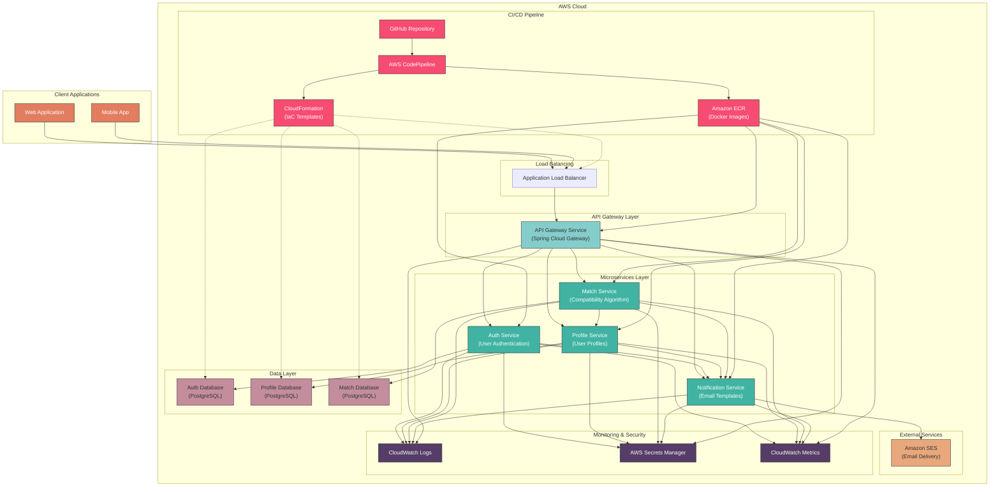

# RoomieMatcher Microservices - Architecture

This document provides a detailed overview of the RoomieMatcher microservices architecture and its AWS deployment.

## Architecture Diagram

## Architecture Components

### Client Applications
- **Web Application**: Browser-based client application
- **Mobile App**: Native mobile applications (iOS/Android)

### AWS Cloud Infrastructure

#### Load Balancing
- **Application Load Balancer**: Routes external traffic to the API Gateway service

#### API Gateway Layer
- **API Gateway Service**: Spring Cloud Gateway implementation that routes client requests to appropriate microservices
  - Features: JWT authentication, circuit breakers, rate limiting, request logging, CORS support

#### Microservices Layer
- **Auth Service (Port 8081)**: Handles user authentication, registration, and verification
  - Endpoints: /api/v1/auth/*
  - Features: JWT token generation, user registration, email verification

- **Profile Service (Port 8082)**: Manages user profiles and tenant preferences
  - Endpoints: /api/v1/profiles/*
  - Features: Tenant profile management, preference settings

- **Match Service (Port 8083)**: Implements roommate compatibility algorithms and matching
  - Endpoints: /api/v1/matches/*
  - Features: Compatibility scoring, potential match finding

- **Notification Service (Port 8084)**: Sends email notifications using templates
  - Endpoints: /api/v1/notifications/*
  - Features: Email template rendering, AWS SES integration

#### Data Layer
- **Auth Database**: PostgreSQL database for user authentication data
- **Profile Database**: PostgreSQL database for user profiles and preferences
- **Match Database**: PostgreSQL database for match records and compatibility data

#### External Services
- **Amazon SES**: Simple Email Service for sending transactional emails

#### CI/CD Pipeline
- **GitHub Repository**: Source code repository
- **AWS CodePipeline**: Continuous integration and deployment pipeline
- **Amazon ECR**: Container registry for Docker images
- **CloudFormation**: Infrastructure as Code templates for AWS resources

#### Monitoring & Security
- **CloudWatch Logs**: Centralized logging for all services
- **AWS Secrets Manager**: Secure storage for sensitive credentials
- **CloudWatch Metrics**: Performance monitoring and alerting

## Service Communication

### Synchronous Communication
- REST APIs with Feign clients for service-to-service communication
- JWT token propagation for maintaining authentication context

### Security
- JWT-based authentication
- Secure credential storage in AWS Secrets Manager
- Network isolation with VPC and security groups
- HTTPS for all external communication

## Deployment Architecture

### VPC Configuration
- Public subnets for the API Gateway and load balancer
- Private subnets for microservices
- Private subnets for databases

### ECS Fargate
- Containerized deployment without managing servers
- Auto-scaling based on CPU and memory utilization
- Service discovery for inter-service communication

### RDS PostgreSQL
- Separate databases for each service
- Multi-AZ deployment for high availability in production
- Automated backups and point-in-time recovery

## Scaling Strategy

### Horizontal Scaling
- ECS services scale based on CPU/memory utilization
- Load balancer distributes traffic across service instances

### Database Scaling
- Read replicas for read-heavy workloads
- Vertical scaling for increased capacity

## Monitoring and Observability

### Logging
- Centralized logging with CloudWatch Logs
- Structured logging format for easier analysis

### Metrics
- Service-level metrics (response time, error rate)
- Infrastructure metrics (CPU, memory, network)
- Custom business metrics (user registrations, matches)

### Alerting
- CloudWatch Alarms for critical metrics
- Notification via SNS for operational issues